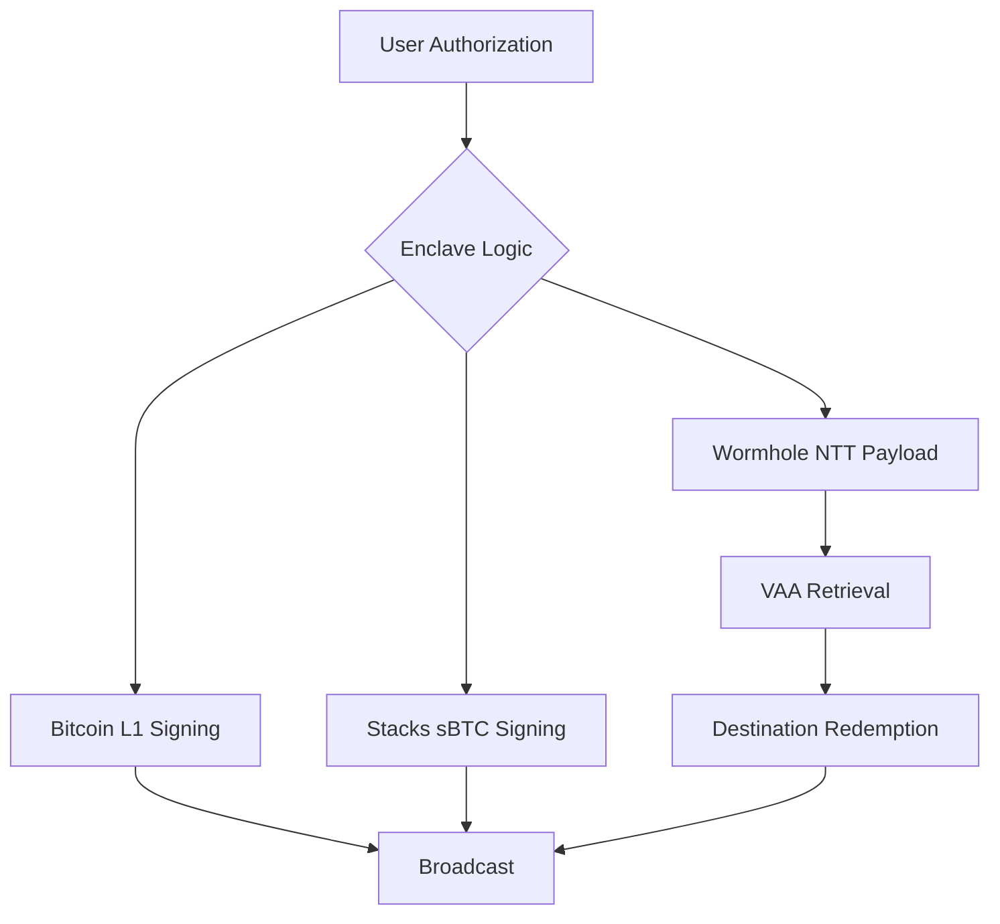

# Conxius Wallet PRD (Production Grade)

## 1. Executive Summary

**Product:** Conxius Wallet, a **Multi-Chain Sovereign Interface**, an offline-first Android wallet that bridges the Bitcoin ecosystem (L1, Lightning, Stacks, Rootstock, Liquid, Nostr) with interlayer execution capabilities, including Wormhole-based Native Token Transfers (NTT).

**Mission:** Deliver hardware-level security on a mobile device, enabling sovereign management of Bitcoin L1 and L2 assets.

**Value Proposition:** *Hardware-level security without the dongle.*

**Monetization:** Capture fees on cross-chain NTT executions and gas abstraction services.

---

## 2. Business & Competitive Landscape

### 2.1. Business State: [ALL COMPLETED]

- **[MARKET_FIT]:** [COMPLETED]
- **[RISK_COMPLIANCE]:** [COMPLETED]
- **[TOKENOMICS]:** [COMPLETED]
- **[ROADMAP]:** [COMPLETED]

### 2.2. Industry Benchmarking (2024 Analysis)

| Competitor | Core Strength | Conxius Advantage |
| :--- | :--- | :--- |
| **Zeus / Phoenix** | Deep Lightning UX | Conxius anchors Lightning in a multi-chain Enclave. |
| **Ledger / Trezor** | Hardware Security | Conxius provides TEE security + Native L2 execution. |
| **MetaMask** | Web3 Ecosystem | Conxius applies Web3 agility to a Bitcoin-first root. |
| **BlueWallet** | Multi-account BTC | Conxius expands utility to Nostr and NTT Bridging. |

---

## 3. Core Technical Specifications

### 3.1. Architecture

The primary differentiator is the **Native Enclave Core**: keys for all supported protocols are generated and used within a hardened boundary (Android Keystore + memory-only seed handling) and never leave the device's secure memory.

### 3.2. Complexity Analysis & Performance

To maintain sub-second performance on mobile hardware, all core scanning and derivation logic is optimized for linear time complexity.

**UTXO Scanning Complexity:**
The algorithm for identifying spendable outputs across multiple layers is bounded by:
$$ O(n) $$
Where $n$ is the number of UTXOs in the user's set.

**Gas Calculation Formula:**
Cross-chain execution costs are calculated using the following model to ensure transparency during the "Sovereign Handshake":
$$ TotalFee = (Size_{tx} \times Rate_{gas}) + Fee_{relayer} + Fee_{convenience} $$

**Performance Hardening (Persistence & Fusion):**
To target a >90% reduction in address derivation latency, the architecture employs a singleton **Persistent Crypto Worker** with session-level caching for PBKDF2 (200k+ iterations). Additionally, **ECC Engine Fusion** integrates `@noble/curves` for high-speed point arithmetic, specifically for Taproot tweaking using BigInt-level coordinate access (`P.hasEvenY()`).

### 3.3. Visual Logic: The Operational Handshake

### 3.5. Production Infrastructure Dependencies (Crucial for "No Mock" Policy)

To achieve full production functionality without mocks, the following external infrastructure MUST be provisioned and configured. The Android app cannot function in "Sovereign Mode" without these components.

| Component | Requirement | Purpose | Config Variable |
| :--- | :--- | :--- | :--- |
| **Changelly Proxy** | Self-hosted Middleware (Node.js/Go) | Protects API keys; proxies JSON-RPC 2.0 requests to `api.changelly.com`. | `VITE_CHANGELLY_PROXY_URL` |
| **Bisq gRPC Proxy** | Middleware + Bisq Daemon | Translates REST/WS → gRPC to a running Bisq node. | `VITE_BISQ_PROXY_URL` |
| **Wormhole NTT Contracts** | Deployed Smart Contracts | Source/Dest Token Managers and Transceivers on ETH/ARB/BASE/SOL. | `NTT_CONFIGS` (in `ntt.ts`) |
| **Liquid Federation Script** | JSON Config / Endpoint | Federation Redeem Script required for Peg-in address generation. | `LIQUID_FEDERATION_SCRIPT` |
| **Marketplace API** | Bitrefill / Silent.Link Keys | Real inventory and purchase execution for eSims/Airtime. | `MARKETPLACE_API_KEY` |
| **Play Integrity API** | Google Cloud Project | Device attestation (Root/Emulator detection). | `PLAY_INTEGRITY_PROJECT_NUMBER` |

---

## 4. Functional Requirements

### 4.1. Key Management (Native Enclave Core)

- **FR-KEY-01**: Master Seed must be encrypted at rest using Android Keystore AES-GCM.
- **FR-KEY-02**: Recovery Phrase (Mnemonic) must be encrypted and stored in `mnemonicVault` for future secure retrieval.
- **FR-KEY-03**: Decrypted seed must reside in memory only during signing/startup and be zeroed immediately after.
- **FR-KEY-04**: Biometric authentication must be required to decrypt the master seed or mnemonic for high-value operations.
- **FR-KEY-05**: Support standard derivation paths:
  - Bitcoin (Native Segwit): `m/84'/0'/0'/0/0`
  - Bitcoin (Taproot): `m/86'/0'/0'/0/0`
  - Stacks: `m/44'/5757'/0'/0/0`
  - Rootstock (EVM): `m/44'/60'/0'/0/0`
  - Liquid: `m/84'/1776'/0'/0/0`
  - Nostr: `m/44'/1237'/0'/0/0`

### 4.2. Transactions & Bridge

- **FR-TX-01**: Must support BIP-84 (Native Segwit) derivation.
- **FR-TX-02**: Must parse and validate BIP-21 URIs.
- **FR-TX-03**: Must prevent dust outputs during coin selection.
- **FR-TX-04**: Support atomic swaps via **Changelly API v2** (proxied) and **THORChain** (native).
  - *Requirement:* Changelly execution must use `createTransaction` via proxy.
  - *Requirement:* THORChain execution must use `SWAP:` memos.
- **FR-TX-05 (Fee Optimization)**: Real-time fee estimation across all supported layers and support for RBF/CPFP.

#### 4.2.1. Wormhole NTT (Native Token Transfers)

- **FR-NTT-01**: Full execution lifecycle: Source signing → VAA Retrieval → Destination redemption. [PRODUCTION]
  - *Requirement:* Integration with `@wormhole-foundation/sdk` and `@wormhole-foundation/sdk-definitions-ntt`.
- **FR-NTT-02**: No NTT "VAA" (Verified Action Approval) can be broadcast without a local Conclave-generated proof (Sovereign VAA). [PRODUCTION]
- **FR-NTT-03**: Support for Multi-Asset tracking and redemption (sBTC, USDC, etc.). [PRODUCTION]

#### 4.2.2. Sovereign Bridge Protocol

- **Root Alignment**: All multi-chain assets, including NTT-bridged tokens, are slaves to the Bitcoin-root Conclave. ETH addresses are treated as deterministic derivatives.
- **Identity Mapping**: NTT operations (Burn/Mint) are mapped to BTC-anchored identities.
- **Logic Isolation**: Bridge transceiver logic functions as a "messenger" preparing payloads for the Conclave.

---

## 5. Non-Functional Requirements

### 5.1. Security

- **NFR-SEC-01**: No sensitive data in logs (seed, private keys, macaroons).
- **NFR-SEC-02**: App preview in "Recents" must be obscured (FLAG_SECURE).
- **NFR-SEC-03**: Root detection warning on startup.
- **NFR-SEC-04**: 0-Gas efficiency for Identity and Lightning Auth.

### 5.2. Reliability & Performance

- **NFR-REL-01**: App must work offline (view cached state).
- **NFR-REL-02**: Bridge state must persist across app restarts.
- **NFR-PERF-01**: Cold launch to Lock Screen < 1s.
- **NFR-PERF-02**: Unlock to Dashboard < 2s.

---

## 6. Sovereign Expansion Architecture (Matrix)

| Protocol | Conclave Integration Path | Status |
| :--- | :--- | :--- |
| **Bitcoin L1** | Native Rust (BDK) | PRODUCTION |
| **Lightning** | JNI Bridge (Greenlight) | PRODUCTION |
| **Stacks (Clarity 4)** | Capacitor (Stacks.js) | PRODUCTION |
| **Liquid** | GDK Integration | PRODUCTION |
| **Rootstock** | Web3 / Ethers.js | PRODUCTION |
| **NTT Bridge** | Sovereign Transceiver | PRODUCTION |
| **ETH Satellite** | EIP-712 Adapter | PRODUCTION |
| **Web5 (TBD)** | DIDs and DWN storage | PRODUCTION |
| **BitVM** | Fraud Proof Verifier | RESEARCH |
| **Citrea** | ZK-STARK Verifier | RESEARCH |

---

## 7. Production-Ready UX: The Sovereign Handshake

The final user experience for NTT transfers is designed to be a "Sovereign Handshake." A complex, multi-stage, cross-chain operation is reduced to a single user authorization, followed by a persistent, non-blocking status tracker documented in [UX_FLOW_FINAL.md](docs/UX_FLOW_FINAL.md).

---

## 8. Continuous Improvement & Verification

- **PRD Updates**: This document is the source of truth.
- **Testing**: Every PR must pass `testDebugUnitTest` for Android and `npm test` for logic.
- **Verification**: Release builds are verified on physical Pixel devices before publication.
