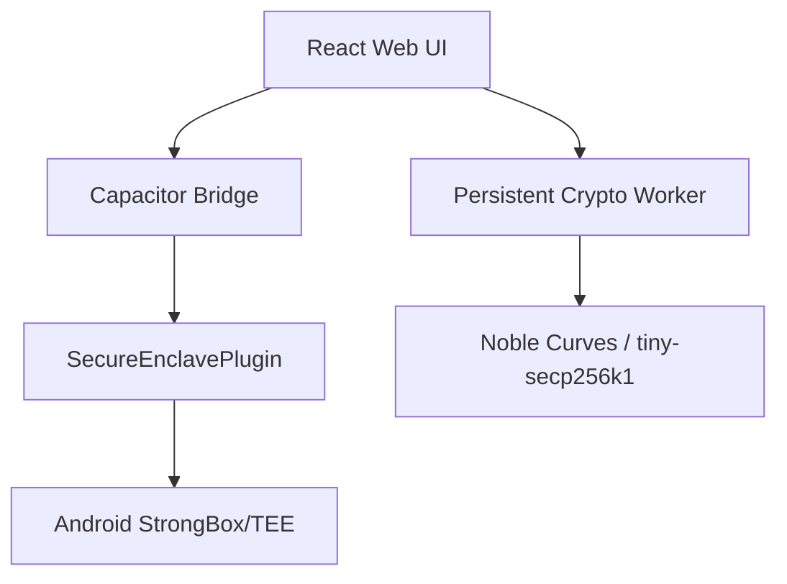

# Conxius Wallet: The Sovereign Citadel for the Bitcoin Ecosystem

[](https://opensource.org/licenses/MIT)
[](https://github.com/Conxian/Conxius_Wallet/actions)
[](https://bitcoin.org)
[](https://developer.android.com/training/articles/keystore)

### **Hardware-level security without the dongle.**

Conxius is the ultimate "Bitcoin-First" mobile interface, engineered to provide native, TEE-protected access to the entire Bitcoin stack. From L1 savings and Lightning payments to Stacks DeFi, Liquid sidechains, and RGB assets—Conxius is your single point of sovereignty.

---

## ⚡ 5-Second Value Proposition

*   **Secure by Design:** Private keys are locked in Android's **StrongBox/TEE (The Conclave)**. They never leave the hardware.
*   **Unified Sovereignty:** One app for BTC (Taproot/SP), Lightning, Stacks (sBTC), Liquid, BOB, RSK, RGB, Ordinals, and Runes.
*   **Zero-Friction Interop:** Move assets between layers using the **Sovereign NTT Bridge** with built-in gas abstraction.
*   **Privacy First:** Native Tor integration, Silent Payments, and AI-powered privacy scoring.

---

## 🏗️ System Architecture

Conxius utilizes a hybrid security model that bridges high-level web technologies with low-level Android security primitives.



- **The Conclave (Android TEE):** Handles key generation, storage, and signing within an isolated execution environment.
- **Persistent Crypto Worker:** A singleton Web Worker that offloads heavy cryptographic math (BIP-32, PBKDF2) from the UI thread while keeping sensitive buffers in short-lived memory.
- **Sovereign NTT Bridge:** Orchestrates Native Token Transfers across Bitcoin layers using Conclave-signed VAAs.

---

## 🛠️ Supported Layers & Protocols

*   **Bitcoin L1:** Native Segwit (BIP-84), Taproot (BIP-86), Silent Payments (BIP-352).
*   **Layer 2s:** Stacks (Nakamoto/sBTC), BOB (Build On Bitcoin), Rootstock (RSK).
*   **Sidechains:** Liquid (L-BTC).
*   **Assets:** Ordinals, Runes, BRC-20, RGB (Client-side validation).
*   **Interoperability:** Wormhole NTT, Boltz Swaps, THORChain.
*   **Advanced:** BitVM (On-device verifier), Ark (VTXOs), State Chains, Maven.

---

## 🚀 Getting Started

**Prerequisites**
*   Node.js (v20+)
*   Android Studio + SDK (for TEE/StrongBox verification)
*   Java 21+
*   pnpm (v10+)

**Quick Install**
```bash
pnpm install
pnpm run dev # Launches with Mock Enclave for web testing
```

**Android Production Build**
```bash
npx cap sync android
cd android && ./gradlew :app:installDebug
```

---

## 🧪 Testing & Verification

We maintain a rigorous testing protocol to ensure cryptographic integrity and security.

```bash
pnpm test          # Run Vitest suite (145+ tests)
pnpm run lint      # Run ESLint for code quality
pnpm run test:e2e  # Run Playwright E2E tests
```

| Metric | Result |
| :--- | :--- |
| **Total Tests** | 145+ |
| **Status** | 100% Passing |
| **Security Layer** | Android StrongBox / TEE |

---

## 📂 Documentation

*   [**CONTRIBUTING.md**](CONTRIBUTING.md) - How to help build the future of sovereignty.
*   [**ROADMAP.md**](ROADMAP.md) - Operational Levels & Milestones.
*   [**PRD.md**](PRD.md) - Technical & Business Specifications.
*   [**RISK_REGISTRY.md**](RISK_REGISTRY.md) - BitcoinLayers.org Compliance.
*   [**MONETIZATION.md**](MONETIZATION.md) - The Sovereign Revenue Model.

---

## 🤝 Community & Support

- **Code of Conduct:** Please review our [CODE_OF_CONDUCT.md](CODE_OF_CONDUCT.md).
- **Security:** Report vulnerabilities via [SECURITY.md](SECURITY.md).
- **License:** Distributed under the MIT License. See [LICENSE.md](LICENSE.md) for details.

Conxius is strictly non-custodial. We partner with regulated entities (**Transak, VALR, Changelly**) for on-ramps without ever touching user funds.
