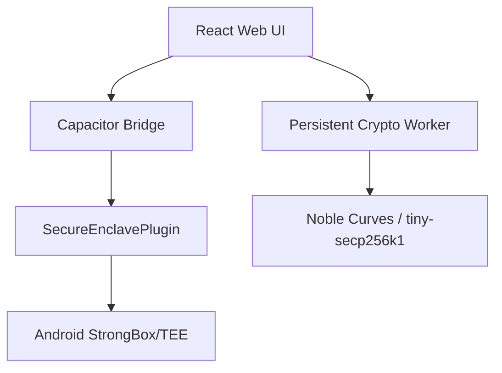

# Conxius Wallet: The Sovereign Citadel for the Bitcoin Ecosystem

[](https://opensource.org/licenses/MIT)
[](https://github.com/Conxian/Conxius_Wallet/actions)
[](https://bitcoin.org)
[](https://developer.android.com/training/articles/keystore)

## **Hardware-level security without the dongle.**

Conxius is the ultimate "Bitcoin-First" mobile interface, engineered to provide
native, TEE-protected access to the entire Bitcoin stack. From L1 savings and
Lightning payments to Stacks DeFi, Liquid sidechains, and RGB assets—Conxius
is your single point of sovereignty.

---

## ⚡ 5-Second Value Proposition

**Secure by Design:** Private keys are locked in Android's
**StrongBox/TEE (The Conclave)**. They never leave the hardware.
**Unified Sovereignty:** One app for BTC (Taproot/SP), Lightning, Stacks
(sBTC), Liquid, BOB, RSK, RGB, Ordinals, and Runes.
**Zero-Friction Interop:** Move assets between layers using the
**Sovereign NTT Bridge** with built-in gas abstraction.
**Privacy First:** Native Tor integration, Silent Payments, and AI-powered
privacy scoring.

---

## 🏗️ System Architecture

Conxius utilizes a hybrid security model that bridges high-level web
technologies with low-level Android security primitives.



- **The Conclave (Android TEE):** Handles key generation, storage, and signing
  within an isolated execution environment.
- **Persistent Crypto Worker:** A singleton Web Worker that offloads heavy
  cryptographic math (BIP-32, PBKDF2) from the UI thread while keeping
  sensitive buffers in short-lived memory.
- **Sovereign NTT Bridge:** Orchestrates Native Token Transfers across Bitcoin
  layers using Conclave-signed VAAs.

---

## 🛠️ Supported Layers & Protocols

- **Bitcoin L1:** Native Segwit (BIP-84), Taproot (BIP-86), Silent Payments
  (BIP-352).
- **Layer 2s:** Stacks (Nakamoto/sBTC), BOB (Build On Bitcoin), Rootstock
  (RSK).
- **Sidechains:** Liquid (L-BTC).
- **Assets:** Ordinals, Runes, BRC-20, RGB (Client-side validation).
- **Interoperability:** Wormhole NTT, Boltz Swaps, THORChain.
- **Advanced:** BitVM (On-device verifier), Ark (VTXOs), State Chains, Maven.

---

## 📂 Repository Structure

```text
.
├── android/            # Native Android project (Capacitor)
├── components/         # React UI components
├── docs/               # In-depth documentation
│   ├── architecture/   # System design and infra
│   ├── business/       # Strategy, PRD, and monetization
│   ├── legal/          # Compliance and risk registries
│   ├── operations/     # Roadmap and release guides
│   ├── protocols/      # Layer-specific implementation details
│   └── archive/        # Historical reports and snapshots
├── public/             # Static assets
├── scripts/            # Maintenance and utility scripts
├── services/           # Core business logic and crypto
└── tests/              # Comprehensive test suites
```

---

## 🚀 Getting Started

### Prerequisites

- Node.js (v20+)
- Android Studio + SDK (for TEE/StrongBox verification)
- Java 21+
- pnpm (v10+)

### Quick Install

```bash
pnpm install
pnpm run dev # Launches with Mock Enclave for web testing
```

### Android Production Build

```bash
pnpm cap sync android
cd android && ./gradlew :app:installDebug
```

---

## 🧪 Testing & Verification

We maintain a rigorous testing protocol to ensure cryptographic integrity and
security.

```bash
pnpm test          # Run Vitest suite (162+ tests)
pnpm run lint      # Run ESLint for code quality
pnpm run test:e2e  # Run Playwright E2E tests (including Full System Integration)
```

| Metric | Result |
| :--- | :--- |
| **Total Tests** | 162+ |
| **Status** | 100% Passing |
| **Security Layer** | Android StrongBox / TEE |

---

## 📈 Build & SDK Baselines

- **Android Native**: compileSdk/targetSdk **35**, minSdk **24**, Java 17,
  Kotlin **1.9.25**, AGP **8.4.2**. Compose BOM **2024.04.01**, compiler
  **1.5.15**. Biometric **1.1.0** (stable), Security Crypto **1.1.0**,
  Coroutines **1.9.0**, Room **2.6.1**. BDK **0.30.0** (upgrade path to 1.x
  tracked).
- **Capacitor Bridge**: Capacitor **8.2.x**
  (core/android/browser/local-notifications). Postinstall node_modules patches
  removed—Android stack is aligned to SDK 35.
- **JS Runtime**: React **19**, Vite **7**, TypeScript **5.9**. Stacks SDK
  **7.3.x**, Wormhole SDK **4.10.x**, Noble curves/hashes **2.0.1**. Tailwind
  **4.1.x**.
- **Versioning Policy**: Android versionCode/Name tracked in
  `android/app/build.gradle.kts`; JS semver in `package.json`. Keep them in
  lockstep per release tag. Version catalog lives at
  `android/gradle/libs.versions.toml` for all native modules.
- **Testing**: Use `pnpm test`, `pnpm run lint`, `pnpm run test:e2e`, and
  `./gradlew test` for native modules. Run `npx cap sync android` after
  dependency bumps.

---

## 🔐 Security, Compliance, and Passkey/Post-Quantum Notes

- **Passkeys/FIDO2**: Target Android Credential Manager APIs for WebAuthn
  passkeys; prefer hardware-backed keys (StrongBox). Require user verification
  (biometric/PIN) and bind to RP ID; emit telemetry on attestation flow for
  auditability.
- **TEE Discipline**: All keygen/signing remains in StrongBox/TEE; never
  export seeds/mnemonics. Web layer must treat passkeys as opaque handles and
  avoid in-memory copies longer than necessary.
- **CARF/OECD Awareness**: Exchange/fiat on-ramp partners may require CARF
  reporting. Wallet remains non-custodial, but surface explicit consent before
  any data egress; ensure jurisdictional checks live in partner-flows (see
  `docs/legal`).
- **Sentinel Filters**: No secrets in logs; redact at source. Prefer on-device
  evaluation for risk signals and avoid third-party analytics by default.
- **Bitcoin Finality First**: Critical flows should anchor to Bitcoin burn-block
  height and enforce ≥6 confs where value-bearing.

---

---

## � Documentation Index

### 🏢 Business & Strategy

- [**PRD.md**](docs/business/PRD.md) - Technical & Business Specifications.
- [**WHITEPAPER.md**](docs/business/WHITEPAPER.md) - Theoretical foundation.
- [**MONETIZATION.md**](docs/business/MONETIZATION.md) - Revenue model.
- [**ROADMAP.md**](docs/operations/ROADMAP.md) - Operational Levels & Milestones.

### 🛡️ Security & Legal

- [**SECURITY.md**](SECURITY.md) - Security policy.
- [**RISK_REGISTRY.md**](docs/legal/RISK_REGISTRY.md) - BitcoinLayers.org Compliance.
- [**PARTNERS_AND_COMPLIANCE.md**](docs/legal/PARTNERS_AND_COMPLIANCE.md) -
  Partner-delegated flows.

### ⚙️ Implementation & Protocols

- [**IMPLEMENTATION_REGISTRY.md**](docs/protocols/IMPLEMENTATION_REGISTRY.md) -
  Ground-truth feature status.

- [**SOVEREIGN_BRIDGE_STRATEGY.md**](docs/protocols/SOVEREIGN_BRIDGE_STRATEGY.md)
  - Cross-chain logic.
- [**UX_FLOW_FINAL.md**](docs/protocols/UX_FLOW_FINAL.md) - User journey mapping.

---

## 🤝 Community & Support

- **Contributing:** See [CONTRIBUTING.md](CONTRIBUTING.md).
- **Code of Conduct:** Review our [CODE_OF_CONDUCT.md](CODE_OF_CONDUCT.md).
- **License:** Distributed under the MIT License. See [LICENSE.md](LICENSE.md)
  for details.

Conxius is strictly non-custodial.
We partner with regulated entities (**Transak, VALR, Changelly**)
for on-ramps without ever touching user funds.
